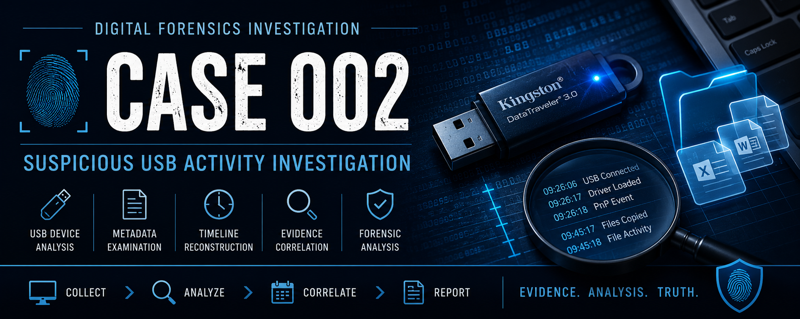

# Case 002 – Suspicious USB Activity Investigation

## Executive Summary

This investigation was conducted to determine whether a USB storage device had been connected to a Windows workstation and whether sensitive documents were copied to removable media.

Using native Windows forensic artifacts and Autopsy, evidence was collected and analyzed to identify USB activity, examine file metadata, verify file integrity, and reconstruct a timeline of events.

The investigation confirmed that a Kingston DataTraveler 3.0 USB device was connected to the system and that multiple documents were copied to external storage. Hash analysis verified that the copied files were identical to their original counterparts.

---

## Investigation Objectives

The objectives of this investigation were to:

* Identify USB devices connected to the workstation
* Analyze Windows event logs for device activity
* Examine document metadata and timestamps
* Compare original files with copied versions
* Verify file integrity using cryptographic hashes
* Reconstruct a timeline of user activity
* Determine whether evidence supports file transfer to removable media

---

## Scenario

An organization suspected that an employee connected an unauthorized USB storage device to a workstation and copied potentially sensitive files.

The investigator was tasked with determining:

* Whether a USB device was connected
* Which device was used
* Whether files were copied to the device
* Whether any files were modified prior to transfer

---

## Evidence Collected

### Documents

* Employee-Salaries.xlsx
* Quarterly-Budget.xlsx
* Executive-Notes.docx

### System Artifacts

* Windows Event Viewer Logs
* Device Manager USB Device Information
* PowerShell File Timeline Output
* File Metadata Properties

### Forensic Tools

* Autopsy 4.23.1
* Windows Event Viewer
* Device Manager
* Windows PowerShell

---

## Analysis

### USB Device Identification

Device Manager identified a connected removable storage device:

**Kingston DataTraveler 3.0 USB Device**

This device was subsequently correlated with Windows event log activity.

---

### Event Log Analysis

Windows Event Viewer contained records associated with USB device initialization and Plug-and-Play operations.

Relevant events included:

| Event ID | Description                                |
| -------- | ------------------------------------------ |
| 2003     | Driver loading for newly discovered device |
| 2100     | Plug-and-Play device activity              |
| 2102     | Device management operation                |

Observed timestamps:

* 09:26:06 AM
* 09:26:17 AM
* 09:26:18 AM

These events confirmed successful device detection and initialization.

---

### Metadata Analysis

File metadata revealed that all investigated documents existed prior to USB activity.

#### Employee-Salaries.xlsx

| Attribute | Timestamp   |
| --------- | ----------- |
| Created   | 09:01:46 AM |
| Modified  | 09:01:47 AM |

#### Quarterly-Budget.xlsx

| Attribute | Timestamp   |
| --------- | ----------- |
| Created   | 09:02:15 AM |
| Modified  | 09:02:15 AM |

#### Executive-Notes.docx

| Attribute | Timestamp   |
| --------- | ----------- |
| Created   | 09:02:51 AM |
| Modified  | 09:28:20 AM |

The metadata established that the files were present on the workstation before the USB device was connected.

---

### Autopsy Analysis

Autopsy was used to analyze both the original files and the copied versions stored within the USB evidence set.

The analysis identified:

* Matching file names
* Matching file sizes
* Matching cryptographic hashes
* Separate storage locations
* Distinct creation timestamps

Hash verification confirmed that the copied files were identical to their original counterparts.

This evidence strongly supports that the files located on the USB device were copied from the workstation.

---

## Timeline Reconstruction

| Time     | Event                                  |
| -------- | -------------------------------------- |
| 09:01:46 | Employee-Salaries.xlsx created         |
| 09:02:15 | Quarterly-Budget.xlsx created          |
| 09:02:51 | Executive-Notes.docx created           |
| 09:26:06 | USB activity begins                    |
| 09:26:17 | Driver load event recorded             |
| 09:26:18 | Additional USB initialization activity |
| 09:28:20 | Executive-Notes.docx modified          |
| 09:45:17 | USB copies created                     |
| 09:45:18 | Additional file activity recorded      |

The timeline demonstrates that the documents existed prior to USB activity and that copied versions appeared after device connection.

---

## Findings

### Finding 1

A removable storage device was connected to the workstation.

**Evidence:**

* Device Manager
* Event Viewer Logs

---

### Finding 2

The connected device was identified as a Kingston DataTraveler 3.0 USB device.

**Evidence:**

* Device Manager
* Event Viewer Device Information

---

### Finding 3

Sensitive documents existed on the workstation before USB activity occurred.

**Evidence:**

* File Metadata
* PowerShell Timeline

---

### Finding 4

The investigated files were copied to removable media.

**Evidence:**

* Matching hashes
* Matching file sizes
* Separate storage locations
* Distinct creation timestamps

---

### Finding 5

Executive-Notes.docx was modified before the copied version appeared within the USB evidence set.

**Evidence:**

* Metadata timestamps
* Autopsy timeline analysis

---

## Conclusion

The investigation confirmed that a Kingston DataTraveler 3.0 USB storage device was connected to the workstation.

Analysis of Windows event logs, file metadata, and Autopsy artifacts demonstrated that multiple documents existed on the workstation prior to USB activity and were subsequently duplicated to removable media. Hash verification confirmed the copied files were identical to their original versions.

Based on the available evidence, the findings support the conclusion that files were copied from the workstation to external storage after document creation and modification activity occurred.

---

## Lessons Learned

* USB activity can be reconstructed using Windows event logs and device artifacts.
* File metadata provides valuable context during forensic investigations.
* Timeline reconstruction helps correlate user actions and system activity.
* Hash analysis is critical for validating copied files.
* Autopsy provides an effective platform for metadata analysis and evidence correlation.
* Proper documentation is essential for maintaining investigative integrity.

---

## Skills Demonstrated

* Digital Forensics
* USB Artifact Analysis
* Event Log Analysis
* Metadata Analysis
* Timeline Reconstruction
* Hash Verification
* Evidence Documentation
* Autopsy
* Windows Forensics
* Incident Investigation
