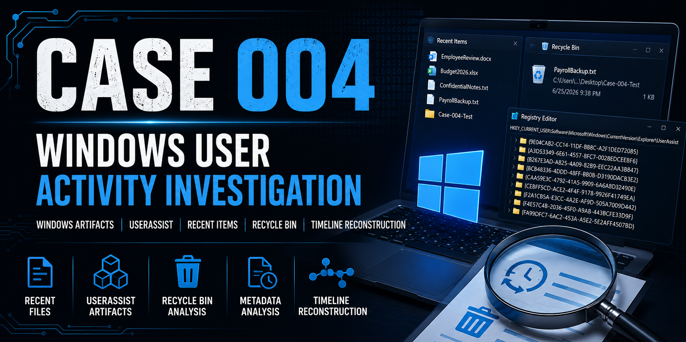

# Case 004 – Windows User Activity Investigation

## Executive Summary

This investigation was conducted to analyze Windows user activity artifacts and determine whether documents were accessed, applications were executed, and files were deleted on a Windows workstation.

Using native Windows forensic artifacts, Registry analysis, PowerShell, and file system metadata, evidence was collected and analyzed to reconstruct user activity. The investigation identified recently accessed documents, recovered evidence of file deletion through the Recycle Bin, examined UserAssist registry artifacts, and established a timeline of user actions.

The investigation confirmed that multiple documents were accessed, a file was deleted but remained recoverable within the Recycle Bin, and Windows user activity artifacts successfully documented the sequence of events.

---

## Investigation Objectives

The objectives of this investigation were to:

* Analyze Windows Recent Items artifacts
* Examine UserAssist Registry artifacts
* Investigate deleted file activity
* Analyze file metadata and timestamps
* Reconstruct a timeline of user actions
* Determine whether evidence supports document access and deletion activity

---

## Scenario

An organization suspected that a user accessed multiple documents, launched applications, and attempted to remove evidence by deleting a file before leaving a workstation.

The investigator was tasked with determining:

* Which files were recently opened
* Whether files had been deleted
* Whether deleted files remained recoverable
* Whether Windows artifacts documented user activity
* Whether a timeline of activity could be reconstructed

---

## Evidence Collected

### Documents

* EmployeeReview.docx
* Budget2026.xlsx
* ConfidentialNotes.txt
* PayrollBackup.txt (Deleted)

### System Artifacts

* Windows Recent Items
* UserAssist Registry Artifact
* Recycle Bin
* PowerShell File Metadata

### Forensic Tools

* Windows File Explorer
* Windows Registry Editor
* Windows PowerShell

---

## Analysis

### Recent Items Analysis

Windows Recent Items contained shortcut entries for the files accessed during the investigation.

Observed artifacts included:

* EmployeeReview.docx
* Budget2026.xlsx
* ConfidentialNotes.txt
* PayrollBackup.txt
* Case-004-Test Folder

The presence of these shortcuts confirms that the files were recently accessed by the user.

---

### Recycle Bin Analysis

The Recycle Bin contained the deleted file:

**PayrollBackup.txt**

Evidence included:

* Original file location
* Deletion timestamp
* File size
* Recovery availability

The file had been deleted but was still recoverable because the Recycle Bin had not been emptied.

---

### Metadata Analysis

PowerShell was used to examine creation and modification timestamps.

#### EmployeeReview.docx

| Attribute | Timestamp              |
| --------- | ---------------------- |
| Created   | 06/25/2026 09:29:14 PM |
| Modified  | 06/25/2026 09:35:30 PM |

#### Budget2026.xlsx

| Attribute | Timestamp              |
| --------- | ---------------------- |
| Created   | 06/25/2026 09:30:16 PM |
| Modified  | 06/25/2026 09:36:02 PM |

#### ConfidentialNotes.txt

| Attribute | Timestamp              |
| --------- | ---------------------- |
| Created   | 06/25/2026 09:29:45 PM |
| Modified  | 06/25/2026 09:36:31 PM |

The metadata established the order in which documents were created and modified throughout the investigation.

---

### UserAssist Registry Analysis

Windows Registry UserAssist artifacts were examined to identify evidence of user activity.

Registry Location:

```text
HKEY_CURRENT_USER\Software\Microsoft\Windows\CurrentVersion\Explorer\UserAssist
```

UserAssist maintains encoded records associated with application execution and user interaction.

The registry artifact confirmed the presence of user activity records consistent with application execution during the investigation.

---

## Timeline Reconstruction

| Time        | Event                            |
| ----------- | -------------------------------- |
| 09:29:14 PM | EmployeeReview.docx created      |
| 09:29:45 PM | ConfidentialNotes.txt created    |
| 09:30:16 PM | Budget2026.xlsx created          |
| 09:35:30 PM | EmployeeReview.docx modified     |
| 09:36:02 PM | Budget2026.xlsx modified         |
| 09:36:31 PM | ConfidentialNotes.txt modified   |
| 09:37 PM    | Recent Items artifacts generated |
| 09:38 PM    | PayrollBackup.txt deleted        |

The timeline demonstrates a clear progression of document creation, modification, user access, and file deletion.

---

## Findings

### Finding 1

Multiple documents were accessed during the investigation.

**Evidence:**

* Windows Recent Items
* File Metadata

---

### Finding 2

Windows Recent Items successfully recorded recently accessed documents.

**Evidence:**

* Recent Items Folder

---

### Finding 3

PayrollBackup.txt was deleted but remained recoverable within the Recycle Bin.

**Evidence:**

* Recycle Bin
* Deletion Timestamp

---

### Finding 4

File metadata established the sequence of document creation and modification.

**Evidence:**

* PowerShell Metadata Analysis

---

### Finding 5

UserAssist Registry artifacts confirmed Windows maintained records of user activity.

**Evidence:**

* Windows Registry
* UserAssist Keys

---

## Conclusion

The investigation confirmed that multiple documents were accessed and modified during the examination period and that Windows user activity artifacts successfully documented these actions.

Analysis of the Recent Items folder, Recycle Bin, Registry UserAssist keys, and file metadata demonstrated that user activity can be reconstructed through multiple independent forensic artifacts. Additionally, the deleted file remained recoverable, illustrating that deletion alone does not permanently remove evidence from a Windows system.

Based on the available evidence, the findings support the conclusion that Windows user activity artifacts provide valuable insight into document access, application execution, and file deletion events.

---

## Lessons Learned

* Windows Recent Items provide valuable evidence of recently accessed files.
* Deleted files often remain recoverable through the Recycle Bin.
* UserAssist Registry artifacts help identify user activity and application execution.
* File metadata assists with reconstructing user timelines.
* Correlating multiple Windows artifacts strengthens forensic conclusions.
* Proper documentation improves the integrity and repeatability of investigations.

---

## Skills Demonstrated

* Digital Forensics
* Windows User Activity Analysis
* Registry Artifact Analysis
* UserAssist Investigation
* Recycle Bin Analysis
* Metadata Analysis
* Timeline Reconstruction
* Evidence Documentation
* Windows Forensics
* Incident Investigation
